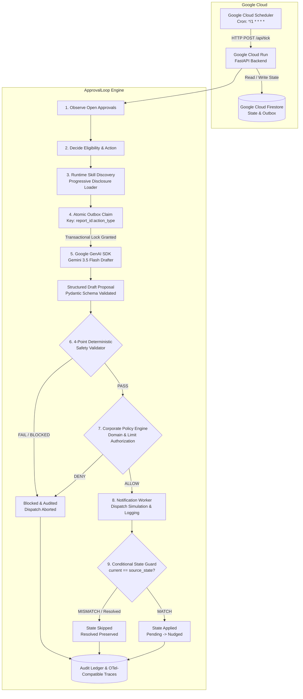

# 🚀 ApprovalLoop

**ApprovalLoop is an autonomous AI agent that monitors stalled expense approvals and takes bounded, validated action without waiting for a human prompt.**

---

## 📌 Problem

Modern enterprise operations silently grind to a halt because **approvals stall in human inboxes**.

An employee submits an expense report, access request, or vendor invoice. The designated approver travels, gets overwhelmed with meetings, or forgets. Nobody prompts an AI chatbot because nobody is watching the clock. The workflow silently stalls, deadlines pass, and business velocity is lost.

---

## 💡 Solution

**ApprovalLoop** is an unprompted autonomous follow-up agent that monitors workflow health and acts on stalled human tasks.

Driven by a background schedule (**Google Cloud Scheduler**), ApprovalLoop wakes up periodically, observes pending approval states, determines when an approval has become stale, calls **Gemini 3.5 Flash** to draft polite, contextual reminders, verifies every parameter against strict deterministic code invariants, checks corporate governance policy, claims the action atomically, dispatches notifications, and conditionally updates business state.

---

## 🤖 Why This Is an Autonomous Agent (Not a Chatbot)

Unlike conversational assistants that wait for user prompts:

1. **Runs Asynchronously:** Executes in the background without human presence.
2. **Wakes on Schedule:** Google Cloud Scheduler triggers execution cycles autonomously (`*/1 * * * *`).
3. **Evaluates State:** Scans open approvals and evaluates elapsed time against immutable thresholds.
4. **Plans & Drafts:** Decides required interventions (*Nudge* vs *Escalate*) and drafts contextual communication using Gemini 3.5 Flash with structured output validation.
5. **Validates Before Action:** Enforces a strict 4-point deterministic safety validator gate.
6. **Authorizes via Policy:** Evaluates corporate governance rules (domain whitelist, financial limits, environment guards).
7. **Executes Bounded Action:** Dispatches notification payloads through a deterministic simulated worker with delivery receipt logging.
8. **Continuous Lifecycle:** Persists audit records, records OpenTelemetry-compatible traces, sleeps, and repeats the loop indefinitely.

---

## 🔑 Core Architecture Principle: *“LLM proposes. Code disposes.”*

In autonomous financial and operational systems, non-deterministic models must **never** hold authoritative power over state changes, money, or recipients.

| Decision / Property | Handled By | Safety Guarantee |
| :--- | :--- | :--- |
| **Workflow State Machine** | Deterministic Code | Strict transitions (`Pending → Nudged → Escalated → Resolved`) |
| **Monetary Values** | Python `Decimal` | Exact precision, zero floating-point drift |
| **Elapsed Time & Stale Rules** | Deterministic Code | Evaluated on immutable timestamps against strict thresholds |
| **Approver Hierarchy** | Approver Registry | Resolves primary, backup, and fail-closed corporate admin |
| **Contextual Communication** | **Gemini 3.5 Flash (Google GenAI SDK)** | Polite, situation-aware structured language drafting |
| **Safety Gate** | **4-Point Deterministic Validator** | Intercepts & blocks any recipient, amount, report ID, or state mismatch |
| **Governance Authorization** | **Corporate Policy Engine** | Enforces domain restrictions, high-value financial rules, and env guards |
| **Concurrency & Idempotency** | **Transactional Outbox Claim** | Atomic claim before drafting (`{report_id}:{action_type}`) |
| **Race-Condition Safety** | **Conditional Transition Guard** | Enforces `current_state == action.source_state` |

---

## 🔄 Autonomous Workflow & Architecture



---

## 🛡️ Safety & Reliability Architecture

ApprovalLoop implements a **4-Point Deterministic Safety Validator + Corporate Policy Engine + Transactional Idempotency Gate**:

```
[Candidate Action]
       │
       ▼
┌────────────────────────────────────────────────────────┐
│ 1. Transactional Idempotency Gate                      │
│ Atomic claim on `{report_id}:{action_type}` in DB       │
└──────────────────────┬─────────────────────────────────┘
                       │ Claim Granted
                       ▼
┌────────────────────────────────────────────────────────┐
│ 2. Gemini 3.5 Flash Drafter (Language Wording Only)    │
│ Strict Pydantic DraftProposalResponse validation       │
└──────────────────────┬─────────────────────────────────┘
                       │ Structured Proposal
                       ▼
┌────────────────────────────────────────────────────────┐
│ 3. 4-Point Deterministic Safety Validator              │
│ - Recipient Verified (Authoritative Registry Check)   │
│ - Report ID Verified (Matches Authoritative Record)    │
│ - Amount Verified (Exact Decimal Match)                │
│ - State Verified (Legal State Machine Transition)      │
└──────────────────────┬─────────────────────────────────┘
                       │
                       ▼ PASS
┌────────────────────────────────────────────────────────┐
│ 4. Corporate Policy Engine                             │
│ - Domain Whitelist / Anti-Spoofing Policy             │
│ - High-Value Financial Escalation Policy (≥ $5,000)   │
│ - Production Environment Safety Guards                 │
└──────────────────────┬─────────────────────────────────┘
                       │
             ┌─────────┴─────────┐
             ▼                   ▼
           ALLOW               DENIED / BLOCKED
```

1. **Deterministic State Machine:** Restricts transitions strictly to legal paths (`Pending → Nudged → Escalated`, terminal `Resolved`). Direct jumps or reverts are blocked.
2. **Transactional Outbox Claim:** Actions are atomically claimed before invoking Gemini, preventing duplicate runs and wasted LLM tokens during concurrent ticks.
3. **Scenario 13 Race-Condition Guard:** If an approver resolves a report while a notification is in transit, the commit guard verifies `current_state == action.source_state`. If the report was resolved, the transition is recorded as **`SKIPPED`** and the `Resolved` state is preserved.
4. **Deterministic Notification Worker:** The notification dispatch engine models the complete delivery lifecycle, logging unique message IDs, tracking receipt timestamps, and testing provider-side deduplication without sending unsolicited emails from test environments.
5. **OpenTelemetry-Compatible Execution Tracing:** End-to-end spans (`approval.tick`, `observe`, `eligibility`, `claim`, `gemini.draft`, `validation`, `policy.check`, `notification`, `state_transition`) are recorded for observability without logging sensitive credentials.
6. **Agent Bill of Materials (AgBOM):** Declared runtime dependency and safety inventory of models, frameworks, datastores, tools, and safety layers exposed at `/api/agbom`.
7. **Agent Skill:** Reusable procedural knowledge defined in [`skills/approval_escalation/SKILL.md`](file:///d:/hackathon/skills/approval_escalation/SKILL.md) loaded dynamically at runtime via `SkillRegistry` using progressive disclosure.

---

## ☁️ Google Cloud Proof & Technologies

- **Gemini 3.5 Flash (`gemini-3.5-flash`):** Default model for contextual language generation.
- **Google Agent Framework (Google GenAI SDK `google-genai`):** Official Python SDK for invoking Gemini models.
- **Google Cloud Run:** Serverless container hosting the FastAPI backend and React Single-Page Application.
- **Google Cloud Firestore:** Scalable NoSQL database with transactional outbox and state storage.
- **Google Cloud Scheduler:** Managed serverless cron service triggering autonomous execution cycles (`*/1 * * * *`).

---

## 💻 Local Setup & Quickstart

### 1. Prerequisites
- Python 3.10+
- Node.js 18+

### 2. Installation
```powershell
# 1. Activate virtual environment
.\.venv\Scripts\Activate.ps1

# 2. Set Gemini API key (optional for offline fallback, recommended for live LLM)
$env:GEMINI_API_KEY="your-gemini-api-key"
$env:GEMINI_MODEL="gemini-3.5-flash"

# 3. Start the application (FastAPI + React Dashboard on port 8080)
python -m uvicorn approval_loop.api.app:app --host 127.0.0.1 --port 8080 --reload
```

Open **http://127.0.0.1:8080** in your browser.

---

## ⚙️ Environment Variables

| Variable | Default | Description |
| :--- | :--- | :--- |
| `APP_ENV` | `demo` | Environment mode (`test`, `demo`, `production`) |
| `GEMINI_API_KEY` | *None* | Google Gemini API Key (injected via environment or Secret Manager) |
| `GEMINI_MODEL` | `gemini-3.5-flash` | Gemini model version (`gemini-3.5-flash`) |
| `GOOGLE_CLOUD_PROJECT` | `approval-loop-hackathon` | Google Cloud Project ID |
| `USE_FIRESTORE` | `false` | Set `true` to use Google Cloud Firestore; `false` for in-memory |
| `SCHEDULER_API_KEY` | `dev-scheduler-secret-key` | Secret key for authenticating Cloud Scheduler calls |
| `ADMIN_FALLBACK_EMAIL` | `escalations-owner@company.internal` | Fallback escalation address when no backup approver exists |

---

## 🚀 Google Cloud Deployment

Deploy with one command using the provided script:

```bash
export GOOGLE_CLOUD_PROJECT="your-gcp-project-id"
export GEMINI_API_KEY="your-gemini-api-key"
export GEMINI_MODEL="gemini-3.5-flash"

chmod +x deploy.sh
./deploy.sh
```

---

## 🧪 Automated Testing (39 Tests)

Run the full automated test suite:

```bash
pytest -v backend/tests
```

```text
============================= 39 passed in 0.31s ==============================
```

---

## 🎯 Hackathon Track: Taskmaster

ApprovalLoop is purpose-built for the **Taskmaster** track. It is not a chatbot; it is a **bounded autonomous agent** that executes background operational workflows unprompted, with mathematical, transactional, and policy-governed safety guarantees.

---

## 🎬 4-Minute Demo Script

Run the automated 5-scenario demo in terminal:
```bash
python evals/run_demo_scenarios.py
```

Or demonstrate interactively in the web dashboard (**http://127.0.0.1:8080**):

| Time | Scene | Action & Narrative |
| :--- | :--- | :--- |
| **0:00–0:30** | **Problem Statement** | *“Expense approvals silently stall because everyone is waiting for someone else.”* |
| **0:30–1:15** | **Silence & Stalled Approval** | Show `EXP-102` stalled in `Pending` state. *“Nobody prompted an agent. But the clock is running.”* |
| **1:15–2:00** | **Autonomous Workflow** | Cloud Scheduler wakes the service $\rightarrow$ Skill loaded $\rightarrow$ Gemini 3.5 Flash drafts $\rightarrow$ 4-Point Validator & Policy Engine authorize $\rightarrow$ notification dispatched $\rightarrow$ state transitions `Pending → Nudged`. |
| **2:00–2:40** | **Safety Intercept** | Click **"Safety Intercept Demo"**. Adversarial prompt proposes sending \$99,999 to an external attacker $\rightarrow$ Deterministic Validator rejects it (**`BLOCKED`**). |
| **2:40–3:20** | **Race & Idempotency** | Click **"Scenario 13 Race Test"**. Approver signs off mid-flight while notification is in transit $\rightarrow$ transition is **`SKIPPED`** and report status is safely preserved as **`Resolved`**. Repeated ticks produce **0 duplicate sends**. |
| **3:20–3:50** | **Google Cloud Proof** | Show Cloud Run service, Cloud Scheduler cron trigger, Firestore collections, AgBOM metadata (`/api/agbom`), OpenTelemetry-compatible traces (`/api/traces`), and live `/healthz` endpoint. |
| **3:50–4:00** | **Closing** | *“ApprovalLoop doesn't wait for another prompt. It notices, decides within strict boundaries, acts, and records what happened.”* |
