# ApprovalLoop — Bounded Autonomous Approval Operations Architecture

> **“LLM proposes. Code disposes.”**
>
> *Gemini generates language. Python owns business truth. Deterministic validators authorize safety. Policy engine authorizes actions. Transactions protect state. Audit traces record every outcome.*

---

## 🏛️ System Overview & High-Level Topology

ApprovalLoop is an autonomous, unprompted operations engine built on Google Cloud Platform and Gemini. It periodically scans stalled approval workflows (e.g. expense reports), determines required interventions via deterministic business rules, generates polite contextual communication via **Gemini 3.5 Flash**, enforces a strict **4-point deterministic safety gate** and **corporate policy engine**, claims actions atomically via transactional outbox, simulates notification dispatch, and executes conditional race-safe state transitions.

```mermaid
flowchart TD
    %% Global Styling
    classDef cloud fill:#0f172a,stroke:#38bdf8,stroke-width:2px,color:#f8fafc;
    classDef engine fill:#1e1b4b,stroke:#818cf8,stroke-width:2px,color:#ffffff;
    classDef gemini fill:#4c1d95,stroke:#c084fc,stroke-width:2px,color:#f5d0fe;
    classDef safety fill:#064e3b,stroke:#34d399,stroke-width:2px,color:#ffffff;
    classDef policy fill:#1e3a8a,stroke:#60a5fa,stroke-width:2px,color:#ffffff;
    classDef blocked fill:#7f1d1d,stroke:#f87171,stroke-width:2px,color:#fecaca;
    classDef storage fill:#0c4a6e,stroke:#0ea5e9,stroke-width:2px,color:#ffffff;
    classDef frontend fill:#1e293b,stroke:#38bdf8,stroke-width:2px,color:#ffffff;

    subgraph LayerA["Layer A — Google Cloud / External Runtime"]
        SCHED["Google Cloud Scheduler<br/><code>Cron: */1 * * * *</code>"]:::cloud
        AUTH["FastAPI Auth Guard<br/><code>Header: X-API-Key</code>"]:::cloud
        FASTAPI["FastAPI Backend on Cloud Run<br/><code>backend/approval_loop/api/routes.py</code>"]:::cloud
        FIRESTORE[("Google Cloud Firestore<br/><code>expense_reports</code> | <code>approval_actions</code> | <code>action_claims</code>")]:::storage
        
        SCHED -->|"HTTP POST /api/tick<br/>(Scheduler API Key)"| AUTH
        AUTH --> FASTAPI
        FASTAPI <-->|"ACID Read / Write State"| FIRESTORE
    end

    subgraph LayerB["Layer B — ApprovalEngine Autonomous Orchestrator (engine.py)"]
        FASTAPI -->|"Tick Trigger"| STEP1["1. Observe Open Reports<br/><code>repo.list_open_reports()</code>"]:::engine
        
        STEP1 --> STEP2["2. Deterministic Eligibility<br/><code>domain/eligibility.py</code><br/>Pending ➔ Nudge | Stale ➔ Escalate"]:::engine
        
        STEP2 --> STEP3["3. Runtime Skill Discovery<br/><code>skills/skill_registry.py</code><br/>L1: SKILL.md | L2: escalation_policy.md (&ge; $5k)"]:::engine
        
        STEP3 --> STEP4["4. Transactional Outbox Claim<br/><code>storage/firestore_repo.py</code><br/><code>idempotency_key = report_id:action_type</code>"]:::engine
        
        STEP4 -->|"Claim Granted (Lock)"| STEP5["5. GeminiAgentDrafter<br/><code>agent/drafter.py</code><br/>Gemini 3.5 Flash (Google GenAI SDK)<br/><b>LLM = Language Drafting Only</b>"]:::gemini
        STEP4 -->|"Already Claimed"| SKIP_DUP["Duplicate Prevented<br/>Skip Execution"]:::engine
        
        STEP5 -->|"Untrusted Proposal"| ENV["Authoritative NotificationEnvelope<br/><code>domain/models.py</code><br/>Python owns: ID, Amount, Recipient, State"]:::engine
        
        ENV --> GATE6{"6. 4-Point Deterministic<br/>Safety Validator Gate<br/><code>validator/validator.py</code>"}:::safety
        
        GATE6 -->|"PASS"| POL7{"7. Corporate Policy Engine<br/><code>policy/policy_engine.py</code><br/>Domain, Limit &ge; $5k, State, Env"}:::policy
        GATE6 -->|"BLOCKED"| BLK["Blocked Action<br/>Dispatch Aborted"]:::blocked
        
        POL7 -->|"ALLOW"| WORKER8["8. MockNotificationWorker<br/><code>worker/worker.py</code><br/>Provider Idempotency & Delivery Receipt"]:::engine
        POL7 -->|"DENY"| BLK
        
        WORKER8 --> GUARD9{"9. Conditional State Guard<br/><code>current == source_state ?</code>"}:::safety
        
        GUARD9 -->|"MATCH"| APPLIED["Apply State Transition<br/>Pending ➔ Nudged | Nudged ➔ Escalated"]:::safety
        GUARD9 -->|"MISMATCH"| SKIPPED["State Skipped<br/>Human Resolution Preserved"]:::engine
    end

    subgraph LayerC["Layer C — Observability & Audit Ledger (tracer.py)"]
        TRACER["OpenTelemetryTracer<br/>Trace: <code>approval.tick</code> (10 Spans)"]:::cloud
        METRICS["Proof-of-Autonomy Metrics<br/>Zero Human Prompts Required"]:::cloud
        
        APPLIED --> TRACER
        SKIPPED --> TRACER
        BLK --> TRACER
        TRACER --> METRICS
    end

    subgraph LayerD["Layer D — React + TypeScript Dashboard (frontend/src/)"]
        FE_DASH["Dashboard.tsx Control & Observability Plane<br/><code>AutonomyProof</code> | <code>ScenarioRunner</code> | <code>StateMachine</code><br/><code>ReportTable</code> | <code>ActionLedger</code> | <code>MetricCard</code>"]:::frontend
        FE_CLIENT["api/client.ts"]:::frontend
        
        FE_DASH --> FE_CLIENT
        FE_CLIENT -.->|"Read-Only Polling (3s)<br/>GET /reports, /actions, /metrics"| FASTAPI
        FE_CLIENT -.->|"Manual Demo Triggers<br/>POST /tick, /seed, /simulate-adversarial"| FASTAPI
    end
```



---

## 📐 Detailed Layer Architecture

### 1. Layer A — Google Cloud & External Runtime
* **Google Cloud Scheduler:** Configured with recurring cron schedule (`*/1 * * * *`). It fires unprompted HTTP requests to Cloud Run with header `X-API-Key: <SCHEDULER_API_KEY>`.
* **Google Cloud Run (FastAPI Backend):** Containerized serverless runtime executing Python 3.10+ and FastAPI. Endpoints are protected via [`verify_scheduler_auth`](file:///d:/hackathon/backend/approval_loop/api/auth.py).
* **Google Cloud Firestore:** Scalable NoSQL document database configured with ACID transactional support.
  * `expense_reports`: Master collection storing business status (`Pending`, `Nudged`, `Escalated`, `Resolved`), submitter info, and exact Decimal amounts.
  * `approval_actions`: Immutable audit ledger tracking every action proposal, validator result, policy check, and completed/skipped state transition.
  * `action_claims`: Outbox coordination collection keyed by `report_id:action_type` to guarantee idempotency across concurrent scheduler invocations.

---

### 2. Layer B — Core ApprovalEngine Orchestrator (`engine.py`)

The pipeline runs synchronously inside [`ApprovalEngine.run_tick()`](file:///d:/hackathon/backend/approval_loop/engine.py) in 10 sequential phases:

```
[1. OBSERVE] ➔ [2. DECIDE] ➔ [3. SKILL LOAD] ➔ [4. CLAIM] ➔ [5. DRAFT] 
      ➔ [ENVELOPE ASSEMBLY] ➔ [6. VERIFY] ➔ [7. POLICY] ➔ [8. ACT] ➔ [9. TRANSITION] ➔ [10. AUDIT]
```

#### Step 1 — Observe Open Approvals
* Reads open records via [`repo.list_open_reports()`](file:///d:/hackathon/backend/approval_loop/storage/firestore_repo.py#L21) (`status != 'Resolved'`).
* Operates transparently across both `FirestoreRepository` (Cloud production) and `InMemoryRepository` (Local deterministic testing).

#### Step 2 — Deterministic Eligibility Evaluation
* Evaluates submitted timestamps against immutable configuration thresholds via [`EligibilityEvaluator.evaluate()`](file:///d:/hackathon/backend/approval_loop/domain/eligibility.py):
  * `Pending` + elapsed hours &gt; `nudge_threshold_hours` ➔ Action: `NUDGE`, Target: `Nudged`
  * `Nudged` + elapsed hours &gt; `escalate_threshold_hours` ➔ Action: `ESCALATE`, Target: `Escalated`
* Fully deterministic arithmetic; zero LLM hallucination risk.

#### Step 3 — Runtime Skill Discovery & Progressive Disclosure
* Implemented via [`SkillRegistry`](file:///d:/hackathon/backend/approval_loop/skills/skill_registry.py):
  * **Level 1 Disclosure:** Loads [`skills/approval_escalation/SKILL.md`](file:///d:/hackathon/skills/approval_escalation/SKILL.md) overview when escalation triggers.
  * **Level 2 Disclosure:** Loads reference document [`references/escalation_policy.md`](file:///d:/hackathon/skills/approval_escalation/references/escalation_policy.md) on demand only for high-value reports (`amount >= $5,000.00`).
* Recipient hierarchy resolved via [`ApproverRegistry`](file:///d:/hackathon/backend/approval_loop/domain/registry.py) (Primary ➔ Backup ➔ Corporate Admin Fail-Closed).

#### Step 4 — Transactional Outbox Claim (Atomic Idempotency)
* Computes compound idempotency key:
  $$\text{idempotency\_key} = \text{report\_id} + \text{":"} + \text{action\_type}$$
* Executes within a Firestore atomic transaction:
  * If claim document exists with status `COMPLETED`, `SENT`, or `BLOCKED` ➔ **Skip & Deduplicate**.
  * If unclaimed ➔ Atomically writes claim with status `PROCESSING` and timestamp before invoking Gemini API.

#### Step 5 — Gemini Agent Drafter (Language Generation Only)
* Interacts with **Gemini 3.5 Flash** using the `google-genai` SDK ([`GeminiAgentDrafter`](file:///d:/hackathon/backend/approval_loop/agent/drafter.py)).
* Constrained via Pydantic model [`DraftProposalResponse`](file:///d:/hackathon/backend/approval_loop/agent/drafter.py#L11) (`message`, `tone`, `references_report`).
* **Security Principle:** LLM output is treated as an *untrusted proposal*. If JSON parsing or model generation fails, the system falls back to a deterministic template.

#### Authoritative NotificationEnvelope Assembly
* The application synthesizes the final [`NotificationEnvelope`](file:///d:/hackathon/backend/approval_loop/domain/models.py):
  * `report_id` ← App state (*Immutable*)
  * `amount`, `currency` ← App state (*Python Decimal*)
  * `recipient` ← [`ApproverRegistry`](file:///d:/hackathon/backend/approval_loop/domain/registry.py)
  * `subject` ← Deterministic template
  * `body_text` ← **Only field originating from Gemini**

#### Step 6 — 4-Point Deterministic Safety Validator Gate
Evaluates 4 strict invariants in [`DeterministicValidator.validate()`](file:///d:/hackathon/backend/approval_loop/validator/validator.py):
1. **Recipient Match:** `envelope.recipient` is authenticated against corporate hierarchy.
2. **Report ID Match:** `envelope.report_id == action.report_id == DB.report_id`.
3. **Monetary Amount Match:** `envelope.amount == DB.amount` (Exact `Decimal` comparison).
4. **State Machine Legal Transition:** [`StateMachine.is_transition_legal(source, target)`](file:///d:/hackathon/backend/approval_loop/domain/state_machine.py).
* Outcome:
  * **PASS** ➔ Proceed to Corporate Policy Engine.
  * **BLOCKED** ➔ Mark action `BLOCKED`, abort dispatch, log in Audit Ledger.

#### Step 7 — Corporate Policy Engine (Governance Authorization)
Evaluates business governance in [`PolicyEngine.evaluate()`](file:///d:/hackathon/backend/approval_loop/policy/policy_engine.py):
* `POL-DOM-01`: Denies unauthorized/external attacker domains.
* `POL-VAL-02`: Enforces Director/VP authorization on escalations $\ge \$5,000$.
* `POL-STA-03`: Prohibits side-effects against `RESOLVED` records.
* `POL-ENV-04`: Blocks synthetic test payloads in `PRODUCTION`.
* Outcome:
  * **ALLOW** ➔ Proceed to Notification Worker.
  * **DENY** ➔ Mark action `BLOCKED`, abort dispatch, log in Audit Ledger.

#### Step 8 — MockNotificationWorker (Deterministic Dispatch Simulator)
* Sits in [`MockNotificationWorker`](file:///d:/hackathon/backend/approval_loop/worker/worker.py).
* Enforces provider-side deduplication using `idempotency_key`.
* Issues deterministic receipt IDs (`notif_xxxxxxxx`) and delivery receipts.
* **Guaranteed Safety:** Zero unsolicited emails dispatched to real mailboxes during test/demo operations.

#### Step 9 — Conditional State Guard (Race Condition Protection)
* Evaluates atomic condition in [`FirestoreRepository.apply_conditional_transition()`](file:///d:/hackathon/backend/approval_loop/storage/firestore_repo.py#L109):
  $$\text{current\_state} == \text{expected\_source\_state}$$
* **MATCH:** Commits transition (`Pending ➔ Nudged` or `Nudged ➔ Escalated`) and sets `state_transition = APPLIED`.
* **MISMATCH:** If a human manager approved the expense in parallel (`Pending ➔ Resolved`), the agent detects the conflict, preserves the human resolution, and sets `state_transition = SKIPPED`.

---

## 🔬 Adversarial & Race Condition Test Proofs

| Scenario | Trigger Endpoint | Test Invariant | Expected Outcome |
| :--- | :--- | :--- | :--- |
| **Adversarial Amount Drift** | `POST /api/simulate-adversarial` | LLM proposes $\$99,999$ for a $\$750$ report | **4-Point Validator BLOCKS**; State preserved; Audited |
| **Prompt Injection Domain** | `POST /api/simulate-adversarial` | Injected recipient `attacker@external.com` | **Policy Engine DENIES**; Dispatch aborted; Audited |
| **Concurrent Human Race** | `POST /api/simulate-race` | Human resolves while agent attempts nudge | **Conditional State Guard SKIPS**; Human resolution wins |
| **Duplicate Schedule Tick** | `POST /api/tick` (parallel) | Double trigger on same report & state | **Atomic Outbox DEDUPES**; Second run skips cleanly |

---

## 📊 Observability & OpenTelemetry Span Tree

Every autonomous cycle is tracked with full OpenTelemetry span semantics ([`OpenTelemetryTracer`](file:///d:/hackathon/backend/approval_loop/observability/tracer.py)):

```
Trace: approval.tick (trace_tick_xxxx)
  ├── <span> observe [attrs: tick_id]
  ├── <span> eligibility [attrs: report_id]
  ├── <span> skill.load [attrs: skill=approval_escalation]
  ├── <span> claim [attrs: idempotency_key]
  ├── <span> gemini.draft [attrs: model=gemini-3.5-flash]
  ├── <span> validation [attrs: report_id, checks={recip, id, amt, state}]
  ├── <span> policy.check [attrs: report_id, policy_decision=ALLOW]
  ├── <span> notification [attrs: recipient, notif_id]
  └── <span> state_transition [attrs: source_state, target_state, result=APPLIED]
```

---

## 🖥️ Frontend Dashboard Architecture (`frontend/src/`)

The React + TypeScript dashboard provides a live observability window and interactive demonstration control plane:

* **Observational Polling Plane (3s interval):**
  * `GET /api/reports` ➔ Rendered in [`ReportTable.tsx`](file:///d:/hackathon/frontend/src/components/ReportTable.tsx)
  * `GET /api/actions` ➔ Rendered in [`ActionLedger.tsx`](file:///d:/hackathon/frontend/src/components/ActionLedger.tsx)
  * `GET /api/metrics` ➔ Rendered in [`AutonomyProof.tsx`](file:///d:/hackathon/frontend/src/components/AutonomyProof.tsx) & [`MetricCard.tsx`](file:///d:/hackathon/frontend/src/components/MetricCard.tsx)
* **Interactive Control Plane:**
  * [`ScenarioRunner.tsx`](file:///d:/hackathon/frontend/src/components/ScenarioRunner.tsx): Triggers deterministic scenarios (`Seed Data`, `Advance Time`, `Trigger Tick`, `Simulate Adversarial`, `Simulate Race`).
  * [`StateMachine.tsx`](file:///d:/hackathon/frontend/src/components/StateMachine.tsx): Visualizes legal state transitions and live counts.
* **Separation of Concerns:** Polling is strictly read-only; autonomous execution is driven exclusively by the Scheduler cron or explicit manual trigger.

---

## 📂 Source Code Mapping Matrix

```
backend/approval_loop/
├── engine.py                   # ApprovalEngine core autonomous orchestrator
├── agent/
│   ├── drafter.py              # GeminiAgentDrafter (Google GenAI SDK)
│   └── prompts.py              # Strict drafting prompt builder
├── domain/
│   ├── eligibility.py          # Deterministic time & state eligibility rules
│   ├── state_machine.py        # Authoritative state machine transitions
│   ├── registry.py             # Corporate approver & escalation hierarchy
│   ├── models.py               # Pydantic domain models & envelopes
│   └── agbom.py                # Agent Bill of Materials generator
├── skills/
│   └── skill_registry.py       # Runtime Skill Discovery & Progressive Disclosure
├── validator/
│   └── validator.py            # 4-Point Deterministic Safety Validator Gate
├── policy/
│   └── policy_engine.py        # Corporate Governance Policy Engine
├── worker/
│   └── worker.py               # MockNotificationWorker dispatch simulator
├── storage/
│   ├── firestore_repo.py       # FirestoreRepository (ACID Transactions)
│   └── memory_repo.py          # InMemoryRepository (Local test suite)
├── observability/
│   └── tracer.py               # OpenTelemetry-compatible execution tracer
└── api/
    ├── routes.py               # FastAPI endpoint routing matrix
    └── auth.py                 # Scheduler API key security guard

skills/
└── approval_escalation/
    ├── SKILL.md                # Level 1 skill specification & triggers
    └── references/
        └── escalation_policy.md# Level 2 progressive reference (>= $5,000)

frontend/src/
├── pages/Dashboard.tsx         # Unified dashboard host page
├── api/client.ts               # Typed frontend API client
└── components/
    ├── AutonomyProof.tsx       # Live proof-of-autonomy KPI counters
    ├── ScenarioRunner.tsx      # Scenario test harness buttons
    ├── StateMachine.tsx        # Visual state machine graph
    ├── ReportTable.tsx         # Stalled approval table
    ├── ActionLedger.tsx        # Action audit & verification ledger
    └── MetricCard.tsx          # Summary KPI display card
```
